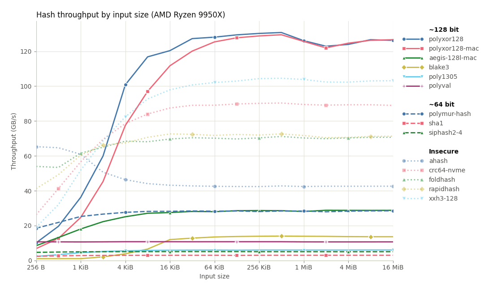
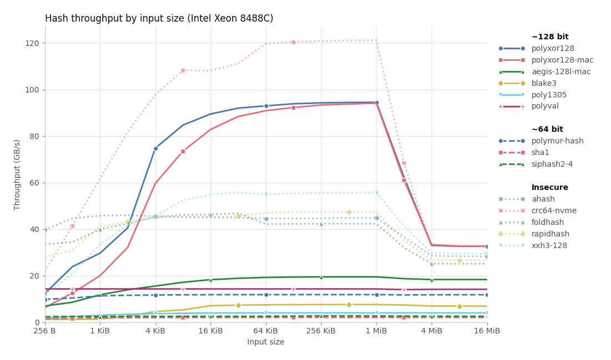
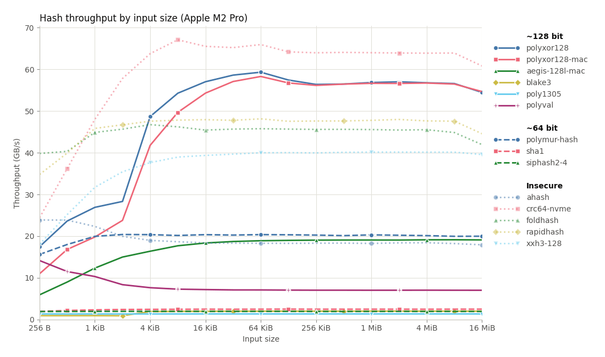

# PolyXOR128

PolyXOR128 is a 128-bit [universal hash function](https://en.wikipedia.org/wiki/Universal_hashing)
designed for fast file/data stream integrity checks with cryptographic strength.
It has some nice properties:

 - It is **mathematically proven** to have a low collision rate. When
   initialized with [**a random key completely independent of the
   input**](#a-note-on-universal-hashing), the probability that two inputs `m`
   and `m'` of up to `n` bytes collide is at most `(n/4096 + 3) / 2^128`. This
   proof is fully formalized in Lean, see the `proofs` directory.

 - It is one of the fastest hash functions available for medium to large inputs,
   reaching throughputs of up to 130 GB/s on a Ryzen 9950X, and 60 GB/s on an
   Apple M2 Pro. It is to my knowledge the fastest 128-bit hash, even beating
   most 64-bit and insecure hashes. See [the benchmarks](#benchmarks) below.

There are potential downsides to PolyXOR128 as well:

 - It essentially requires [carryless
   multiplication](https://en.wikipedia.org/wiki/Carry-less_product#Implementations)
   to be hardware-accelerated. The portable reference implementation is unusably
   slow. Luckily every modern desktop and server CPU supports this, but this may
   be a blocker for embedded devices. Our implementation does dynamic
   dispatch to hardware-accelerated paths for AArch64 and x86-64, even if you do
   not compile with those feature flags enabled.

 - A key-expanded instance of PolyXOR128 takes about 5 KB of memory. This is
   not a problem for most use-cases, but on a server handling millions of secure
   connections each with separate hash instances this might be problematic.

 - It is not currently optimized for small strings (e.g. <= 256 bytes). These
   are simply zero-padded to the next multiple of 128 bytes and are hashed as
   such. This may change in a future (breaking) release.

Finally, PolyXOR128 has not yet received third-party cryptanalysis. Do not use
it if security is paramount. A formal proof of security of the construction does
not cover side-channel attacks, bugs in the implementation, etc. See
[`design.md`](design.md) for an overview of the design.

### License

PolyXOR128 is available under the zlib license.

## A note on universal hashing

There is a big asterisk on the security of PolyXOR128, and in fact on any
universal hash: the data you hash must be completely independent of the random
key. This means the random key must not be publicly known and must remain
**secret**. An attacker **can derive the key from observing hash values**.
You must hide these hash values when communicating over an unsecured channel.

This crate comes with a `finalize_mac` method on the hasher that constructs a
[Message Authentication
Code](https://en.wikipedia.org/wiki/Message_authentication_code) from the hash
value. This essentially encrypts the hash with AES, hiding it from attackers. It
is safe to share this value across unsecured channels, see the Rust docs for
details.

PolyXOR128 is not an alternative to collision-resistant hashes if you cannot
keep the key secret. It can not be used for e.g. public integrity checksums on
packages. If the secret is known it's trivial to construct collisions. It *can*
be used for integrity checksums if malicious modification is not a worry, like
how CRC is used today.

## Benchmarks

I ran single-threaded benchmarks on three machines, a 14-inch Apple M2 Pro, an
AMD Ryzen 9950X, and an Intel Xeon 8488C on Rust 1.98.1 stable with
`RUSTFLAGS="-C target-cpu=native"`. I included a variety of popular hashes, both
secure and insecure. Note that I used their most popular / seemingly-fast
implementation available on crates.io, which I recognize may not necessarily
match the optimal implementation. The benchmarks here are also a fairly ideal
scenario, as we're hashing well-aligned data with a power-of-two size.

At each size we run a ~0.1 s warm-up to calibrate the iteration count, then
report the highest throughput of five ~0.1 s runs.

| Ryzen 9950X | Xeon 8488C | Apple M2 Pro |
|--------|------------|------------|
|  |  |  |

The full data can be found in `assets/`. Note that the drop of the Xeon 8488C
at 2 MiB is due to the hashed data no longer fitting in L2 cache.

## How it works and why it's fast

I have written [a more in-depth design](design.md) document, but the TL;DR is as
follows. We take 128-byte blocks and add key material before splitting it up into
four parts. We compute a fifth part by means of a parity check code expanding
our total to 160 bytes. Each part is then hashed using a carryless
multiplication version of NH (similar to CLHASH), resulting in five hashes.
These hashes are accumulated with XOR. This entire process is done in SIMD,
here's a visualization of the five hashes on a 128-byte block:

We continue this process until we exhaust our pre-computed buffer of key
material (4 KiB). Then we recombine these five hashes into two, which have a
combined 2^-128 collision probability, and absorb that into a polynomial hash.

If we ignore the recombination and polynomial hash reduction (which happens only
once every 4 KiB chunk), this processes 128 bytes using ten 64 x 64 -> 128-bit
carryless multiplications. With AVX-512 on a Ryzen 9950X we can execute one
`_mm512_clmulepi64_epi128` per two cycles, which does four of these
multiplications per instruction. Putting it all together this gives a maximum
throughput of 25.6 bytes / cycle which we get fairly close to.

## A note on the usage of LLMs

All the final code (and prose) written in this library has been written by me,
with the exception of the Lean proofs of universality, some
plotting/benchmarking code and the SIMD diagram. LLMs were used to do rapid
experiments, and test/prove conjectures about the universality of certain
constructions, as well as review code.

I have manually checked that the definitions of PolyXOR128 in the Lean proof
match what is implemented, as well as the ultimate security claims that are
proven, but have not checked the proof that connects them. I only verified that
Lean can successfully check the proof, and that there are no hidden assumed
axioms.

## Acknowledgements

I am standing on the shoulders of giants, and in the well-researched field of
(universal) hash functions there are a lot of them. J. Lawrence Carter, Mark N.
Wegman, Ted Krovetz, Phillip Rogaway, Mikkel Thorup, Daniel J. Bernstein, Daniel
Lemire, Martin Dietzfelbinger, Austin Appleby, Jim Apple, Mridul Nandi, Koustabh
Ghosh, Thomas Ahle, many names come to mind. I have read many publications by
them, and borrowed ideas from all of them.
