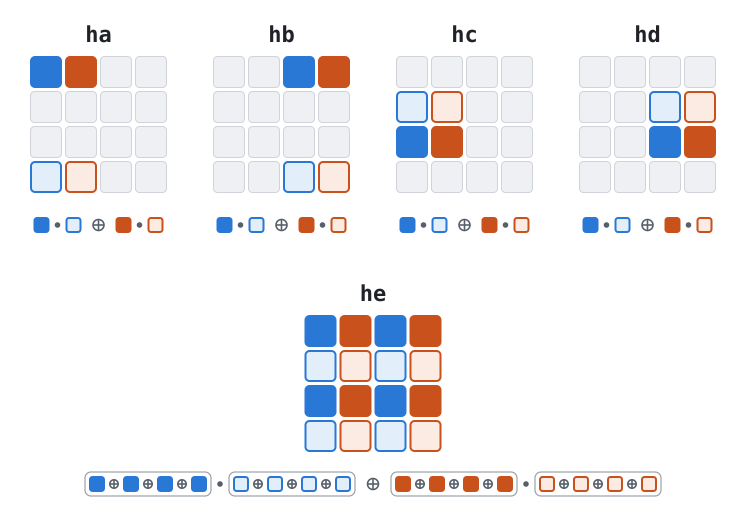

# Design of PolyXOR128

First and foremost the design of PolyXOR128 was influenced by Jim Apple's
[HalftimeHash](https://arxiv.org/abs/2104.08865) which introduced me to Mridul
Nandi's [work on universal hashes](https://eprint.iacr.org/2013/574). In short,
their work showed that you can use coding theory to expand `n` messages (or one
message split into `n` chunks) into `n + k - 1` messages, hash the `n + k - 1`
messages into `n + k - 1` hashes and combine them back into `k` outputs. Then,
assuming you used the right expansion and combination routines, and your hashes
are delta-universal these `k` outputs are (almost, depending on the combination)
as strong as if you hashed the original `n` messages `k` times independently.

In other words, you could make a secure `kb`-bit hash much more efficiently than
doing `k` independent `b`-bit hashes and stitching the results together. Jim
Apple used this to make strong hashes out of 32 x 32 -> 64 bit multiplication,
which is available on almost any platform. I in particular got interested in `k
= 2`, where you can use a trivial parity code for the encoding.


## CLMUL

I've published another universal hash in the past,
[PolymurHash](https://github.com/orlp/polymur-hash), which also intentionally
limited itself to basic operations found almost anywhere, like Jim Apple did.
There are quite a few sacrifices made to work in the prime field GF(2^61 - 1),
when everything would be so much nicer if it could use GF(2^64). This requires
the usage of carryless multiplication which while commonly available isn't
ubiquitous in hardware.

As a change of pace I decided for this hash to adopt carryless multiplication,
accepting the non-portability to all platforms, instead focusing on
high-performance hashing aimed at server/desktop applications that have these
instructions available regardless.

With the knowledge of HalftimeHash I knew I could boost the 64 x 64 -> 128 bit
carryless multiplication to a 128-bit hash. And since the field GF(2^128) is
also easy to construct using these instructions I could avoid the sacrifices Jim
Apple needed to make in his combination matrices (as he worked modulo 2^n where
even numbers have no multiplicative inverse), and reach full 128-bit
universality.


## Compression function

In universal hashing the "NH" hash from UMAC is ubiquitous. Roughly speaking you
take two b-bit words, add a unique key to each, then multiply them into a 2b-bit
word. Then the result is delta-universal: the probability that the difference
between two outputs is some specific delta is at most 2^-b. This may not seem
very useful at first since two b-bit words went in and one 2b-bit word came out,
but delta-universal hashes have a *very* useful property: assuming each has an
independent key you can *add* them, and the output is still delta-universal with
the exact same bound. So with enough data and key material you can make an
embarrassingly parallel hash that compresses everything into one 2b-bit word. NH
was originally defined using integer addition and multiplication, but the exact
same principle works using XOR and carryless multiplication (sometimes referred
to as PH or CLNH).

At the core of PolyXOR128 is the compression function. The initial version took
4 `u64` pairs, created a fifth pair using parity, hashed each pair with CLNH and
combined them using a specific matrix over GF(2^128) where every 2x2 submatrix
is invertible:

```rust
let e0 = a0 ^ b0 ^ c0 ^ d0;
let e1 = a1 ^ b1 ^ c1 ^ d1;
let ha = clmul(a0 ^ k0, a1 ^ k1);
let hb = clmul(b0 ^ k2, b1 ^ k3);
let hc = clmul(c0 ^ k4, c1 ^ k5);
let hd = clmul(d0 ^ k6, d1 ^ k7);
let he = clmul(e0 ^ k8, e1 ^ k9);

// h0 = (1 1 1  1   0) (ha hb hc hd he)^T
// h1 = (0 1 w  w^2 1) (ha hb hc hd he)^T
let h0 = ha ^ hb ^ hc ^ hd;
let h1 = hb ^ gf128mul(hc, w) ^ gf128mul(hd, w2) ^ he;
```

Here `w` is a generator of GF(2^128). This way Nandi's Encode-Hash-Combine
theorems applied, guaranteeing the 256-bit concatenation of `h0, h1` would be
2^-128 almost-XOR-universal (AXU).

This in turn meant that you can use this compression function (using fresh key
material each time) in parallel, and XOR together the results and have a 2^-128
AXU hash over the full input. What's even nicer is that the final matrix
combination distributes over XOR meaning we could accumulate `ha`, `hb`, `hc`,
`hd`, `he` using XOR first and only combine once at the end.

All in all this gave me a 2^-128 AXU **block** compression function that can
take an arbitrary amount of bytes (at the cost of 1.25x input bytes worth of key
material) and compress it to 256 bits.


## Optimizing the compression function

There are three optimizations I've made on the above 'naive' (if you can call it
that) compression function:

1. Using an efficient SIMD layout for parallel evaluation.
2. Using a smaller field.
3. Reducing the amount of key material.

### Using an efficient SIMD layout

This isn't actually an optimization on the compression function itself, but on
how we apply it in parallel to get a *block* compression function. It took a
while to find an optimal layout that works well for NEON, AVX, AVX2 and AVX512
at the same time. In particular NEON was tricky since it can only multiply the
two low halves or the two upper halves of a 128-bit register. I wanted my hash
to be portable so one layout needed to fit all.

In the end I settled on a 128-byte fundamental block which consists of two
parallel applications of our compression function, one on even-indexed words and
another on odd-indexed words. A larger block would avoid a shuffle on AVX-512
but ultimately it didn't end up mattering for performance and it's nice to be
able to reduce the amount of zero-padding.

If we visualize a 128-byte block as a 4x4 matrix of 64-bit words, the block
compression function computes `ha, ..., he` as follows:



Note how for example AVX2 loading 256 bits at once (one whole row of the
diagram) can put `ha, hb` and `hc, hd` into one register for each pair and
compute them directly:

```rust
let hab = _mm256_xor_si256(clmul256::<0x00>(y0, y3), clmul256::<0x11>(y0, y3));
let hcd = _mm256_xor_si256(clmul256::<0x00>(y1, y2), clmul256::<0x11>(y1, y2));
```


### Using a smaller field

Technically Nandi's theorems do not require combination over a field, but simply
a ring. With this in mind and some back-and-forths with an LLM to find more
efficient multiplication structures we found that we can represent each 128-bit
hash as 64 elements in GF(4), apply our combination elementwise and our matrix
would still work.

There are two nice things about GF(4) here. First, we have that `w^2 = w + 1`
so we can simplify our combination to only have one multiplication:

```rust
let h0 = ha ^ hb ^ hc ^ hd;
let h1 = hb ^ gf4mul(hc ^ hd, w) ^ hd ^ he;
```

Second, we can specialize the multiplication by `w`. Again using `w^2 = w + 1`
we see that in GF(4)
``` rust
let wx = ((x << 1) ^ (x & 0b10) ^ (x >> 1)) & 0b11;
```

Rearranged this is "swap the low and high bits, and toggle the new top bit if
the old one was set". The LLM noted that if we reinterpret the u128 word as four
u32s arranged `[lo0, hi0, lo1, hi1]`, where `lo0` contains the low bits of the
first 32 GF(4) elements, `hi0` contains the respective high bits of those
elements, and similarly for `lo1`, `hi1`, we can do this multiplication by `w`
efficiently SIMDized on all platforms with just a shuffle, AND and XOR.

For example on SSE:
```rust
let x_swapped = _mm_shuffle_epi32(x, 0b10_11_00_01);
let high_dwords = _mm_set1_epi64x(0xffff_ffff_0000_0000u64 as i64);
let wx = _mm_xor_si128(x_swapped, _mm_and_si128(x, high_dwords));
```

### Reducing the amount of key material

I remembered reading Koustabh Ghosh et al.'s Multimixer-128 paper, where they
did something rather curious. They had a construction somewhat reminiscent of
Encode-Hash-Combine, but they *first* added key material, and only *then* did an
encoding before hashing. The combine step was trivial, and the analysis had
essentially nothing to do with EHC, but the construction stuck with me.

Out of curiosity I wondered if I could take my above compression function, and
simply add key material before encoding, reducing the amount of key material
needed from `1.25` times the message to simply match the message length.

I asked an LLM to check this conjecture and try to prove it, and it did. The
proof is above my paygrade, so I couldn't easily check it. I asked it to
formalize it in Lean, and it did. I *could* verify the Lean *claims*, and it
checked out.

Unfortunately the proof is rather specific to my construction and not a general
result. But I'll take it anyway.

If we had infinite amounts of fast memory and cache I would choose a very large
chunk size (as it means reducing less often), and the key material savings
wouldn't matter much. However it's critical that the key material stays in L1
cache while hashing, and when using multiple hashes you don't want to clutter
the L2/L3 cache too hard, so it's nice to be able to save some.

After benchmarking I settled on 4 KiB of key material as a trade-off between
speed and resource-intensiveness.


## Polynomial reduction

With a fast 4096-byte -> 256-bit chunk reduction in hand the hard part was done,
as I already knew how to turn that into an arbitrary length universal hash
function from PolymurHash: a polynomial evaluation over a finite field. Since
I'm already using CLMUL anyway, might as well do it over GF(2^128) instead of a
prime field.

Since the reduction doesn't happen that often (only once per chunk) I was
perfectly fine doing a reduction with two GF(2^128) multiplies per
chunk with some pre-computed keys, similar to PolymurHash. I'd take our two
128-bit hashes `h0, h1` and reduce as follows (with precomputed `x2 = x*x`, etc.):
```rust
p = gf128mul(p, x3) ^ gf128mul(h0 ^ x, h1 ^ x2);
```
This maps our `h0`, `h1` injectively (meaning two different `h0`, `h1` give
different polynomials) to a polynomial in `x`, which we evaluate at a secret
`x`.

The recent work by Thomas D. Ahle and Jakob B. T. Knudsen in Fast Evaluation of
Polynomials with Rational Preprocessing made this a bit better however, showing
you can do it with just one multiplication per chunk:
```rust
p = gf128mul(p ^ u, h1 ^ y) ^ h0;
```
where `u`, `y` are independent secrets (and a third initialization secret `p0 = z`).

Like I do in PolymurHash the only necessary final step is to mix in the length
to avoid collisions between differently-sized inputs:

```rust
return gf128mul(p ^ u, len ^ y);
```
